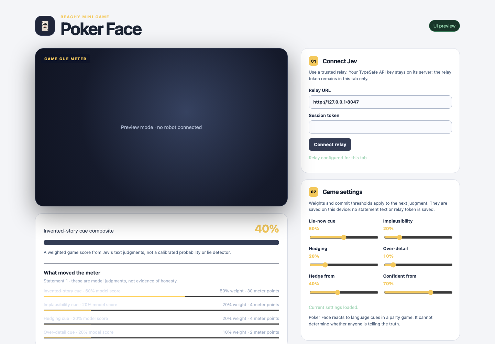

# Reachy Poker Face

A two-truths-and-a-lie game in which Reachy Mini shows uncertainty through its head and antennas. Jev judges *which story sounds most like the invented one in this game*. It does not detect lies or assess a person's honesty.



_Browser fixture after one typed statement. The relay answer is synthetic; no Jev call, robot, or real player was involved. The meter is a game cue, not a lie probability._

The browser app has a Reachy Mini host shell, camera view, text capture, optional browser speech transcription, an opt-in local robot-audio ASR path with word timing, optional robot-speaker game lines through a local TTS companion, an expressive game-cue meter with a four-cue breakdown, configurable cue weights and commit thresholds, a final pick, an optional local nickname leaderboard, consent-gated silent clip capture, and a local round-trace export. A narrow server-side relay keeps the TypeSafe API key out of the browser. If Jev is unavailable at the final pick, the app says so and makes a random theatrical pick; that round is not ranked or counted as a Jev judgment.

The live and final question batches come from versioned `reachy-jev` banks. The shared builder validates their structure before making the TypeSafe wire request; the game still validates returned answers and decides its own theatrical motion in code. A failed live cue leaves its statement open and requests a neutral pose if motion is armed. An ordinary failed final pick is retried **once**; if both attempts fail, the game explicitly makes an unranked random pick. HTTP 429 from the relay is shown as a request limit and is never retried immediately. Persistent HTTP 4xx rejections such as invalid token, origin, endpoint, or request shape also skip the futile retry: a live statement stays unlocked, while a final pick becomes an explicitly unranked random fallback. HTTP 408, server errors, network failures, and unusable model answers retain the bounded final retry. A browser CORS failure may hide its underlying status and appear as a network failure. Resetting the round prevents a second attempt from starting. A retry can make a second billable model call, and aborting the browser request cannot retract work already received by the relay.

This is a development preview, not a hardware-tested release. The UI and core tests run without a robot; synthetic browser streams cover local clip encoding and robot-audio PCM capture, but actual robot-camera capture, microphone quality, antenna-tap behavior, motion, speaker output, and the host shell need a real Reachy Mini validation pass. The local ASR API is fake-model and installed-package tested, **not** tested for recognition quality or timing accuracy on a real model/robot. The robot-speaker path has local WAV and fake-SDK tests, not a live playback result. The calibration reader is tested on synthetic records only; no accuracy or live-robot result is claimed.

## Run locally

Node.js 20.19+ is required. `reachy-jev` is installed from a pinned commit of its [public source repository](https://github.com/AbdelStark/reachy-jev); no sibling checkout or registry release is required. npm runs that package's `prepare` build during installation. Review the pinned source when updating the dependency.

```sh
npm ci
npm run check
npm test
npm run build
npx playwright install chromium
npm run test:e2e
```

The browser suite uses FFmpeg's `ffprobe` to check the downloaded silent clip's actual container, 1280×720 video stream, duration, and absence of audio; install FFmpeg before running it locally. It also tests a browser-advertised MP4 encoder that rejects construction, ensuring WebM fallback. A separate full-round browser test crosses the actual authenticated loopback relay to a fake model, checking the three live requests, final pick, reveal, and text-free trace together. These checks use fixtures and a synthetic canvas, not Jev or Reachy's camera.

To inspect the UI without a robot, run `npm run dev` and open `http://127.0.0.1:5173/?preview=1`. Plain preview does not simulate model answers or robot motion. For a complete no-credential typed round, open `http://127.0.0.1:5173/?preview=1&fixture=1` instead. The page has a prominent **OFFLINE FIXTURE** banner and uses fixed, text-independent cue values for statement slots 1–3 and a fixed pick of statement 2. It makes no relay or Jev request, plays no speech, and has no camera, microphone, motion, ranking, clip, or calibration-trace export. The values say nothing about the submitted words or which statement is true; this route demonstrates the game mechanics only. A browser test completes the fixture round and checks these boundaries. Other end-to-end tests use a synthetic relay to exercise full rounds and failure UI; none is evidence of a live Jev run.

For model-backed local play, set `TYPESAFE_API_KEY`, a random `REACHY_JEV_RELAY_TOKEN` of at least 32 characters, and run `npm run relay` in a separate shell. The relay binds to `127.0.0.1:8047` and accepts only the exact `REACHY_JEV_ALLOWED_ORIGIN` (default `http://127.0.0.1:5173`). It forwards only the reviewed `pokerface.live@0.1.0` and `pokerface.final@0.1.0` question wires with bounded game-shaped state, and accepts at most 30 authenticated POST attempts per minute per relay process. A future bank change needs a reviewed relay-pin update; the source test checks browser/relay agreement. Separately, it reserves one of 30 default upstream attempts before each valid model call; set `REACHY_JEV_MAX_UPSTREAM_ATTEMPTS` to a positive integer up to 10,000 for a different local session limit. Exhaustion returns HTTP 429 until process restart. Failed or timed-out upstream calls still consume an attempt because they may have been processed; rejected requests do not. Both limits reset on restart and neither bounds token usage or spending. Enter the relay URL and token in the app; the token is retained only in the current page. Do not put `TYPESAFE_API_KEY` in Vite variables, the browser, or a Hugging Face Space secret exposed to static JavaScript.

For a hosted static Space, deploy the relay separately behind HTTPS with authentication, TLS, rate limits, and an allowlisted origin. The loopback relay is for local development and is not reachable from someone else's browser. The static Space metadata above follows the Reachy Mini JavaScript app-host format; it is not a claim that this app has been deployed to a Space.

## Optional local robot-audio ASR

This path uses the Reachy host's outbound audio track, **not** the device's browser microphone. Install the optional companion in its own environment, obtain a converted [faster-whisper](https://github.com/SYSTRAN/faster-whisper) model yourself, and review its license. The model directory must already contain `model.bin`, `config.json`, and `tokenizer.json`; the app does not download weights. Set a separate random `REACHY_ASR_TOKEN` of at least 32 characters in your local shell, then start the companion:

```sh
python3 -m venv .venv-asr
.venv-asr/bin/python -m pip install -r requirements-asr.txt
.venv-asr/bin/python scripts/check_asr_api.py
.venv-asr/bin/python -m server.local_asr --model-path /absolute/path/to/converted-model
```

On Windows, use `.venv-asr\Scripts\python.exe` in place of `.venv-asr/bin/python`.

It binds only to `127.0.0.1:8049` and permits exactly `http://127.0.0.1:5173` by default; use `--port` and `--origin` for another local browser origin. In the connected robot app, enter the companion URL and token, start a round, wait for the opening line to sound finished, press **Begin statement 1**, check the separate per-round audio-consent box after everyone audible agrees, then press **Record robot microphone** and **Stop & transcribe**. At most 15 seconds of mono 16 kHz PCM is sent to that loopback service. Its word times are converted in code into pause/filler/restart delivery buckets. Review or edit the returned statement before locking it; editing clears timing-derived delivery cues. The audio is not sent to Jev, saved to disk, or added to clips/traces. The resulting statement text and delivery buckets **are** sent to the configured Jev relay when you lock the statement. The browser and OS may retain transient copies despite the app clearing its buffers.

The companion accepts only an exact origin, a separate bearer token, and 0.25–15 seconds of finite float32 PCM; it limits concurrent inference to one request and returns bounded word records. These are local-development controls, not a public ASR service. A hosted Space cannot reach the viewer's loopback companion; provide an explicitly chosen secured ASR provider and a fresh privacy review before hosted use. The synthetic tests prove ordering and format, not real ASR accuracy, latency, echo cancellation, or microphone availability.

## Optional local robot-speaker TTS

Browser speech remains the default; if Web Speech synthesis is unavailable, game lines stay visible and browser mode remains text-only. Robot-speaker mode does not depend on that browser API. To hear fixed game lines through Reachy instead, install [eSpeak NG](https://github.com/espeak-ng/espeak-ng) and [FFmpeg](https://ffmpeg.org/) on the browser host, set a separate random `REACHY_TTS_TOKEN` of at least 32 ASCII characters, and run `python3 -m server.local_tts`. It binds to `127.0.0.1:8050` and accepts only `http://127.0.0.1:5173` by default; `--port` and `--origin` select another local origin. In a connected robot session, enter that URL and token, choose **Configure local TTS**, then explicitly check **Use Reachy's speaker**. The token stays in page memory and is cleared from the form. The companion is a reference offline voice, not a claimed production voice; review the separately installed tools and their licenses.

Only the introduction, pick, and reveal templates go to this service. The Jev-backed pick can include one fixed, model-attributed cue line; no free-form model output is synthesized. Player statements, microphone audio, and Jev requests do not go to TTS. The companion caps each child process's stdout and stderr while reading, and kills and reaps an overproducing or timed-out child before returning an error. The browser validates a mono 16 kHz PCM16 WAV of at most 20 seconds before SDK upload. The SDK acknowledges playback **started**, not finished; cancellation is a request, not proof the speaker is silent. Statement capture stays closed during the opening line. After confirming the speaker sounds quiet, the operator presses **Begin statement 1**, which also requests cancellation of any remaining intro playback. If the first game disclaimer failed to queue/start or was canceled by switching speaker modes before that confirmation, it is attempted again next round. This software bookkeeping is not proof the line was audible. Resetting, leaving, switching speech modes, and starting robot-microphone capture likewise request cancellation. When robot mode is selected and synthesis/upload/play fails, the game line stays visible and there is no silent fallback to browser speech. This path has synthetic transport/fake-robot tests and an installed-binary local TTS smoke, but no live Reachy Mini test. A hosted static Space cannot reach the viewer's loopback companion without additional deployment design and security review.

## How a round works

Start a round, wait until the opening line sounds finished, then press **Begin statement 1**. Until that confirmation, statement input, microphones, and clip recording stay closed. The player then gives three statements. Each statement gets text-only Jev cues and a deterministic weighted meter; no vocal stress or biometric signal is used. The breakdown shows each model score, normalized weight, and contribution to the composite. This is a theatrical game score, **not a calibrated probability of lying**. The final Jev call asks for one of the three statements, a model-selected top cue, and a theatrical `commit_style` suggestion. The model style is recorded and compared with the app's confidence rule, but never overrides that rule. Both the visible verdict and spoken game line name the top cue through a fixed template and say it is a guess, not proof; an unavailable final judgment is called a random pick and speaks no model cue. No statement text or model-generated sentence is spoken. By default, confidence of at least 0.70 gets a confident pose, 0.40–0.70 a hedge, and below 0.40 a coin-flip pose *only if robot motion is armed*. A connected app sends no pose on mount; the host must check the robot and nearby space and enable motion for that tab. With motion off, typed rounds and the game meter still work, but antenna-tap controls are disabled. Disabling motion stops new game pose requests, not motion already queued by the SDK; retain a physical stop. The host can adjust weights and thresholds; changes apply to the next judgment and only these numeric settings are saved locally. The player then reveals the actual lie. An optional nickname records the robot-fooled count in local storage; leave it blank for a tab-only game. Saved scores can be cleared in the app. Neither statements nor the relay token are stored with them.

The host can press **New round** even while a Jev judgment is pending. This aborts the browser request and invalidates the old round, so a late answer or browser-recognition callback cannot alter the next round. It also clears the optional nickname so the next player's result cannot be silently attributed to the previous player. Aborting locally cannot retract a request already received by the relay or TypeSafe, and it does not undo robot motion or playback already started.

For a clip, obtain consent from everyone visible and check the per-round recording box before starting. Recording begins only after **Begin statement 1**, which keeps the intro out if the operator waits for it to finish; an early click can still capture remaining intro visuals. The app draws the robot camera and meter into a browser canvas, records video only, stops within 30 seconds or at a 16 MB encoded-data cap, and offers a local download after the reveal. It prefers MP4 where the browser can initialize that encoder and falls back to WebM otherwise. On browsers supporting file sharing, an explicit **Share clip…** button opens the native share sheet after the reveal; the app never uploads or shares automatically, and a cancelled share keeps the local clip. Anyone withdrawing consent can ask the host to press **Stop and discard clip** during the round; this stops local recording and discards the clip without ending the game. A finished clip can also be discarded before download or sharing. The clip otherwise stays in memory until download, a new round, or leaving; no clip is uploaded by this app. The overlay intentionally contains no statement text. Discarding in the app cannot retract a file already downloaded or shared.

## Round traces and calibration

After a reveal, the app keeps a session-only JSONL record of the three cue vectors and weights, composite meter values, final pick and confidence, the rule-selected and model-suggested commitment styles plus their disagreement flag, model ID, actual reveal, and whether the pick was correct. Random fallback picks are explicitly marked and contain no model style evidence. No nickname, video, or audio enters the trace. Statement text is **excluded by default**; check the separate per-round text-consent box *before starting* only if the player agrees to include it. The box resets for every round. The trace writer accepts only known delivery labels, cue/weight fields, and bounded pick provenance, and requires a boolean text-consent flag; consented statement text remains capped at 400 characters. These checks protect the export path, not against modified browser code or deliberately encoded information in allowed fields. At most 100 completed rounds remain in memory; download or discard them before leaving the tab. The round API returns defensive snapshots, and mutating a trace result after recording cannot change its stored JSONL; this prevents accidental shared-reference edits, not deliberate tampering with browser state. Downloading a file puts it under your control.

For a local descriptive report, run `npm run calibrate -- path/to/pokerface-trace.jsonl`. The Python standard-library reader rejects ambiguous duplicate JSON keys and impossible fallback model evidence, recomputes the cue composite and threshold-selected style when those inputs are present, separates model IDs, excludes fallback rounds, and reports final-pick accuracy with a Wilson interval, confidence bins, binary Brier score, and expected calibration error. Older minimal traces without cue inputs remain readable but cannot have their composite checked. It separately reports count, coverage, accuracy, and a Wilson interval for final picks whose Choice confidence is **strictly greater than 0.70**; an empty subset has `null` accuracy and interval. The game's confident animation begins at **0.70 or above**, so its visual band is intentionally not the same subset. Choice confidence is used here as a diagnostic forecast, not a validated probability. `pLie` is a theatrical weighted cue composite, not a calibrated probability, and is **not** used for this report. Small or selected samples cannot establish game performance, much less lie-detection ability; the repository publishes no real evaluation result. The synthetic tests only verify the calculation and privacy-default export behavior.

Typing works in the development UI. The separate **browser microphone** button requires its own per-round consent checkbox from everyone audible. It uses the browser's SpeechRecognition implementation, which may send audio to a browser vendor and has no word timings. A final recognized transcript auto-locks after a 1.5-second pause and then goes to the configured Jev relay. Unchecking consent stops recognition, cancels pending automatic submission, and ignores late callbacks; it cannot retract audio already processed by the vendor or a Jev request already sent. The checkbox resets for every new round. The hosted Reachy shell currently does not grant iframe device-microphone access, so browser speech input there is unverified and may be unavailable; type a statement instead. Spoken reactions use browser-local speech synthesis by default, or the opt-in local robot-speaker path above. Neither audio path adds audio to clips or trace exports.

See [SECURITY.md](SECURITY.md) for deployment and privacy boundaries, plus [CONTRIBUTING.md](CONTRIBUTING.md), [CHANGELOG.md](CHANGELOG.md), and [CITATION.cff](CITATION.cff) for project maintenance and citation.
