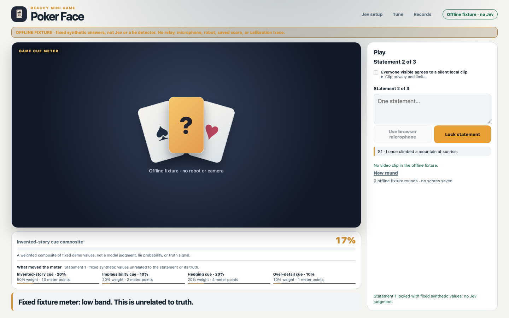

# Reachy Poker Face

**Three stories. One invented. One very expressive Reachy Mini.**

Tell Reachy two true stories and one made-up story. Jev scores language cues, Reachy makes a theatrical guess with its head and antennas, and the player reveals the answer. The camera, cue meter, verdict, and round controls share one desktop view designed for a live demo.

> **This is a party game, not a lie detector.** Its meter is a weighted game cue, not the probability that someone lied. Do not use its guesses to judge a person's honesty or make consequential decisions.



*Offline fixture screenshot. Its answers are fixed by statement slot. No Jev request, robot, camera, speech, or real player was involved.*

## Try it locally

Requires **Node.js 20.19+**. The pinned [`reachy-jev`](https://github.com/AbdelStark/reachy-jev) source is built during `npm ci`.

```sh
npm ci
npm run dev
```

Open **http://127.0.0.1:5173/?preview=1&fixture=1**. Press **Start a round**, then **Begin statement 1**, type and lock three statements, and reveal the invented one. The fixture uses text-independent, fixed cue values and always picks statement 2. It has no relay, microphone, robot, clip, ranking, or calibration export. Use it to inspect the interface and game mechanics; its scores say nothing about the words you enter.

Plain `?preview=1` shows the UI without a robot or simulated answers. It can play a model-backed typed round after you connect a relay.

## Play with Reachy and Jev

You need a Reachy Mini connected to the Reachy Mini desktop host, a linked Hugging Face account for the local JavaScript host, a TypeSafe API key, and two terminal sessions. Keep credentials in an ignored `.env` or `.env.local` file. Use a **different random token of at least 32 characters** for the relay. These are variable names, not sample credentials:

```dotenv
VITE_HF_TOKEN=your_local_host_token
VITE_HF_USERNAME=your_hugging_face_username
TYPESAFE_API_KEY=your_server_side_key
REACHY_JEV_RELAY_TOKEN=your_random_session_token
```

```sh
# Terminal 1: browser app
npm run dev

# Terminal 2: model relay; Node does not load .env automatically
node --env-file=.env server/main.mjs
```

Use `--env-file=.env.local` if that is where you put the values. Open **http://127.0.0.1:5173/** and select your robot. In **Jev setup**, enter `http://127.0.0.1:8047` and the relay token, then connect. The TypeSafe key stays on the relay server; never paste it into the browser. The `VITE_HF_*` values are included in the local browser build, so use them only in a trusted local development environment and never publish a build containing your personal token.

Before enabling **game motion**, clear the space around Reachy's head and antennas and keep the physical stop within reach. Motion is off until you check its box for that tab. Text play still works with motion off. The host requests poses, but the SDK does not prove motion has stopped when a request is canceled.

| During a round | What to do |
| --- | --- |
| Opening line | Wait for speech to finish, then press **Begin statement 1**. Capture stays closed until then. |
| Statements 1–3 | Type a statement and press **Lock statement**. The meter shows the four cue contributions. |
| Final guess | Reachy names its pick and a model-selected cue in a fixed game line. If Jev is unavailable, the UI labels a random, unranked pick. |
| Reveal | To save a score, enter a nickname in **Records** before revealing. Then select the actual invented statement; export a trace afterward if wanted. |

**Jev setup**, **Tune**, **Audio**, and **Records** live in the top toolbar so the game itself fits beside the camera. Tune changes numeric weights and confidence thresholds for the next judgment. A saved nickname is optional; leave it blank for a tab-only round.

## How it works

```text
Player text → browser game → authenticated local relay → TypeSafe / Jev
                    │                     │
                    │                     └─ only pinned live/final question banks
                    ├─ cue meter and deterministic motion rule → Reachy Mini
                    └─ local reveal, optional score, clip, and trace
```

The live and final questions come from versioned `reachy-jev` banks. The relay accepts only the reviewed `pokerface.live@0.1.0` and `pokerface.final@0.1.0` wire shapes. The browser validates answers; game code decides the meter, confidence band, and motion. Neither speech stress nor biometrics are used. The final model call suggests a `commit_style`, but the app's confidence rule controls the pose. A model-selected top cue appears in a fixed, attributed sentence. No player statement or free-form model sentence is spoken.

A failed live cue leaves its statement unlocked. An unavailable final judgment gets **at most one retry**, then an explicitly random fallback that is excluded from ranking and calibration. Observable rate limits and persistent request rejections skip that retry. Resetting a round fences late browser results; it cannot retract a request already processed or billed upstream. See [SECURITY.md](SECURITY.md) for the exact request, privacy, and deployment boundaries.

## Optional audio and clips

| Input or output | Default | How to enable |
| --- | --- | --- |
| Statement input | Typed text | Browser microphone needs separate consent from everyone audible each round. Browser speech recognition may send audio to its vendor; a final transcript auto-locks and cannot be recalled. |
| Game lines | Browser speech, or visible text if unavailable | **Audio** can select Reachy's speaker after configuring the local TTS companion. Only fixed game lines are sent. |
| Robot microphone | Off | **Audio** can configure a local ASR companion. Each capture needs fresh consent and is limited to 15 seconds; its text and delivery buckets go to Jev when locked. |
| Silent clip | Off | Consent from everyone visible is required each round. The browser records up to 30 seconds or 16 MB of camera and meter video, with no audio or statement text. Download or share is explicit; **Stop and discard clip** works mid-round. |

To try **robot-speaker TTS**, install [eSpeak NG](https://github.com/espeak-ng/espeak-ng) and [FFmpeg](https://ffmpeg.org/), set a separate `REACHY_TTS_TOKEN` (32+ ASCII characters), and run `python3 -m server.local_tts`. It binds to `127.0.0.1:8050`. Configure that URL and token in **Audio**, then check **Use Reachy's speaker**. The reference voice is offline and not a production voice. Playback-start and cancel receipts do not prove the speaker has finished or gone silent; wait for the opening line before beginning statement 1.

To try **robot-microphone ASR**, supply your own converted [faster-whisper](https://github.com/SYSTRAN/faster-whisper) model directory containing `model.bin`, `config.json`, and `tokenizer.json`. No weights are downloaded by this project. In a separate environment:

```sh
python3 -m venv .venv-asr
.venv-asr/bin/python -m pip install -r requirements-asr.txt
.venv-asr/bin/python scripts/check_asr_api.py
# Set a separate REACHY_ASR_TOKEN (32+ characters) in this shell.
.venv-asr/bin/python -m server.local_asr --model-path /absolute/path/to/converted-model
```

On Windows, use `.venv-asr\Scripts\python.exe`. The companion binds to `127.0.0.1:8049` by default. Configure it in **Audio**; after everyone audible agrees, check the per-round robot-audio consent box, record, stop, and review the returned statement before locking it. Editing the transcript clears timing-derived delivery cues. The companion receives PCM audio, while Jev receives only the resulting statement text and delivery buckets. Neither local companion is a public service, and a hosted static Space cannot call a viewer's loopback address.

## Records and local calibration

**Records** can store a nickname and a count of rounds that fooled Reachy in this browser's local storage. No statement text or relay token is stored with that score. Clear it in the app.

Completed rounds also stay in **tab memory** as a JSONL trace, up to 100 rounds. Export is manual. The default trace excludes statement text, nickname, audio, and video. Including text requires the player's separate consent **before** the round; the checkbox resets each round. Exported files are under your control and cannot be recalled by the app.

```sh
npm run calibrate -- path/to/pokerface-trace.jsonl
```

The Python reader recomputes available cue composites and reports descriptive pick accuracy, a Wilson interval, confidence bins, Brier score, and expected calibration error for Jev-backed rounds. It separates model IDs and excludes random fallbacks. Small or selected samples cannot establish model performance or lie-detection ability. No real-world calibration result is published here.

## Development and validation

```sh
npm run check
npm test
npm run build
npx playwright install chromium
npm run test:e2e
python3 -m unittest discover -s scripts -p 'test_*.py'
```

The browser suite uses synthetic media and a fake relay; the clip test needs `ffprobe` from FFmpeg to inspect the actual downloaded video. It covers a complete typed round, failure and retry paths, recording, trace privacy, and the offline fixture. The Python tests use fake ASR models and synthetic traces. See [CONTRIBUTING.md](CONTRIBUTING.md) for the full contributor checks and bank-change rules.

**Hardware status, 2026-09-29:** one local Wi-Fi Reachy Mini round completed with a live camera, Jev relay, three cue judgments, final pick, reveal, and trace. The operator confirmed head/antenna motion and robot-speaker game lines. This is a smoke test, not reliability or voice-quality evidence. Real clip capture, robot-microphone ASR quality/timing, and physical antenna taps remain unverified. The static Hugging Face Space metadata above is a deployment format, not a claim that this app has been published as a Space.

The loopback relay is for local use. Before exposing a hosted relay, add TLS, durable abuse limits, secret rotation, and cost monitoring. Its process-local limits do not cap token usage or spending; a retry can be a second billable call. Never place `TYPESAFE_API_KEY` in a Vite variable or static Space asset.

## Project map

| Path | Role |
| --- | --- |
| [`src/embed.ts`](src/embed.ts) | Browser UI, Reachy host bridge, round controls |
| [`src/jev.ts`](src/jev.ts), [`src/round.ts`](src/round.ts) | Versioned questions, judgments, round state |
| [`src/motion.ts`](src/motion.ts), [`src/cues.ts`](src/cues.ts) | Bounded theatrical motion and cue math |
| [`server/relay.mjs`](server/relay.mjs) | Authenticated local model relay |
| [`server/local_asr.py`](server/local_asr.py), [`server/local_tts.py`](server/local_tts.py) | Optional loopback audio companions |
| [`scripts/calibration.py`](scripts/calibration.py) | Offline descriptive trace reader |
| [`e2e/`](e2e/) | Browser and full-round fixture tests |

[Security and privacy](SECURITY.md) · [Contributing](CONTRIBUTING.md) · [Changelog](CHANGELOG.md) · [Citation](CITATION.cff) · [MIT license](LICENSE)
